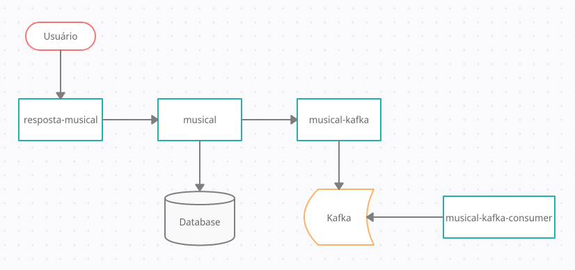

# musical-kotlin
Micro-APIs para implementar um fluxo com interação com um usuário, banco de dados e Kafka.  

Cada micro-serviço possui uma função principal:  
* **resposta-musical** - Expor as rotas no gateway e receber chamadas do usuário  
* **musical - Salvar** e buscar os dados no banco de dados  
* **musical-kafka** - Produzir mensagens no tópico Kafka  
* **misical-kafka-consumer** - Consumir mensagens do tópico Kafka  
